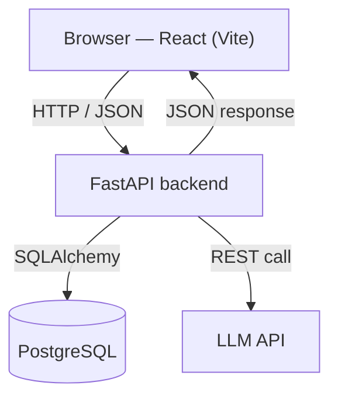

# FeedbackAI

> AI-powered feedback analysis — a full-stack demo built with React, FastAPI, PostgreSQL, and AWS.

FeedbackAI lets users submit free-form text (product reviews, support tickets, survey answers) and uses a large language model to classify sentiment, extract topics, and generate a short summary. Results are persisted and surfaced in a lightweight analytics dashboard.

> **Status:** 🚧 Under active development. This repository is built incrementally, one vertical slice at a time — see the [Roadmap](#roadmap).

---

## Architecture



A user action in the React client triggers an HTTP request to the FastAPI backend. The backend validates the payload, persists it, calls the LLM to analyze the text, stores the result, and returns JSON that the client renders.

---

## Tech stack

| Layer          | Technology                                   |
| -------------- | -------------------------------------------- |
| Frontend       | React + Vite, TypeScript                     |
| Backend        | Python, FastAPI, Pydantic                    |
| Database       | PostgreSQL (SQLAlchemy ORM, Alembic)         |
| AI             | LLM API for sentiment, topics, summarization |
| Infrastructure | AWS (S3 + CloudFront, EC2/Lambda, RDS)       |
| Tooling        | uv, Docker, GitHub Actions, Ruff, ESLint     |

---

## Project structure

```
feedbackai/
├── backend/          # FastAPI application
├── frontend/         # React (Vite) application
├── .gitignore
├── CLAUDE.md         # Project context & conventions for AI-assisted development
└── README.md
```

---

## Getting started

> Setup instructions are added as each part of the stack is implemented.

### Prerequisites

- Python 3.12+ (managed with [uv](https://github.com/astral-sh/uv))
- Node.js LTS (22+)
- Docker (for a local PostgreSQL instance)

### Backend

```bash
cd backend
uv sync
uv run uvicorn app.main:app --reload
```

Interactive API docs are served at `http://localhost:8000/docs`.

### Frontend

```bash
cd frontend
npm install
npm run dev
```

---

## Roadmap

- [ ] **Phase 1** — FastAPI skeleton: REST endpoints, Pydantic validation, auto-generated docs
- [ ] **Phase 2** — PostgreSQL persistence with SQLAlchemy and Alembic migrations
- [ ] **Phase 3** — LLM integration for sentiment, topics, and summarization
- [ ] **Phase 4** — React frontend: submission form, results list, analytics dashboard
- [ ] **Phase 5** — End-to-end wiring, CORS, environment configuration
- [ ] **Phase 6** — Deployment on AWS (S3/CloudFront, EC2 or Lambda, RDS)
- [ ] **Phase 7** — Tests, CI/CD (GitHub Actions), documentation

---

## License

MIT